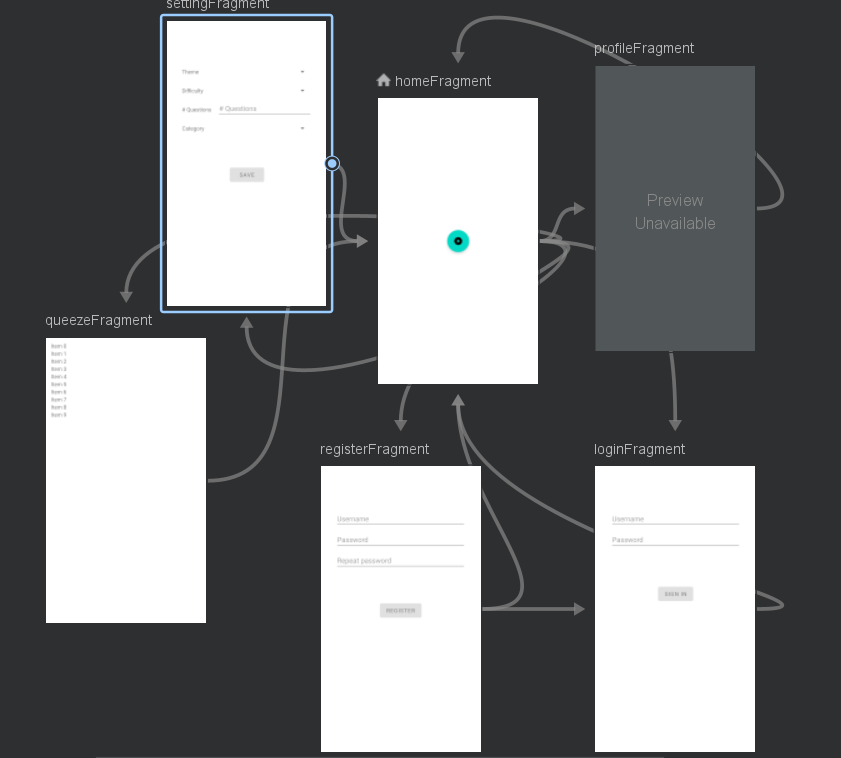
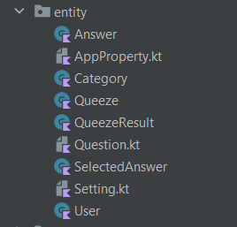
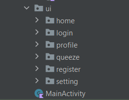
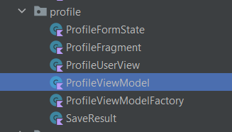

# Letsqueeze

## Owners

- Ahmad Salimi - 97106013 
- Pouya Esmaili - 98105581
- Nazanin Azarian - 98105568

## Application

This application offers general knowledge quizes in form of a game that keeps scores of participants and also provides offline tests.
It consists of following pages:

- Home
<!-- todo -->
- Login
<!-- todo -->
- Register
<!-- todo -->
- Setting
<!-- todo -->
- Profile
<!-- todo -->
- Scoreboard
<!-- todo -->

## Technology

Here are some of the interesting technologies we used in implementing this application:

- Navigation Graph: It helps defining navigation routines between different fragments.

 

- Drawer: It is a slidingleft menu that helps displaying important links in application.

- Room: It is a ORM for easy connection to SQLiteDatabase.

## Architecture

We followed MVVM architecture in designing this application.

### Model

We have a package named entity that includes all our database models.

## View

For each page of the application, there exists a fragment layout which also has its coresponding kotlin file.
There is also a main activity that all fragments are inflated whithin.
 

## View Model

For each page of this app, or in other words for each fragment, we have a view model that is responsible for handeling realated logics between the fragment and the database.

